# InfiniWolf generation flow

This is the end-to-end control flow for InfiniWolf itself. It covers seeded
campaign planning, floor generation, validation, candidate selection, and the
final campaign file. It deliberately does not describe CI/CD, GitHub releases,
or platform distribution packaging.

The central rule is that randomness chooses between bounded, purposeful options.
That balance keeps seeds surprising while preserving readable spaces, fair
progression, and rewards that make exploration enjoyable. Geometry, progression
objects, actors, pickups, and decorations must still pass semantic placement
rules and validation before a floor can be selected.

```mermaid
flowchart TD
    A[CampaignConfig<br/>seed + gameplay/style settings] --> B[LittleEntropyMachine<br/>derive independent deterministic streams]
    B --> B1[_variant_sequence<br/>floor material/theme identities]
    B --> B2[_circulation_sequence<br/>non-repeating building skeletons]
    B --> B3[_lock_schedule<br/>campaign gold/silver gate quota]
    B --> B4[Choose the one secret-elevator source floor]

    B1 --> C{{For floors 1 through 10}}
    B2 --> C
    B3 --> C
    B4 --> C

    C --> D[Derive floor_seed number + attempt<br/>create isolated floor RNG]

    subgraph MAP[generate_map: one candidate floor]
        D --> E[_plan_floor]
        E --> E0[Select special family on floors 9/10<br/>independent of skeleton, districts, and motifs]
        E0 --> E1[Build mandatory spine<br/>ordinary progression, boss sequence, or reward expedition]
        E1 --> E2[Choose 2–3 districts and circulation modes<br/>double-loaded, single-loaded, suite,<br/>service-bays, formal-axis, tunnel-cluster]
        E2 --> E3[Add ring plus optional hub/wings/gallery motifs]
        E3 --> E4[Add filler through district rules<br/>rooms prefer shared corridor nodes]

        E4 --> F[_place_planned_rooms]
        F --> F1[Draw tier-aware sizes<br/>corridors stay narrow and elongated]
        F1 --> F2[Place critical spine first<br/>apply skeleton turn rhythm]
        F2 --> F3[Attach suites/bays/branches to compatible circulation]
        F3 --> F4[Drop optional rooms that cannot remain local<br/>remap surviving rooms and graph edges]

        F4 --> G[Paint room floors into 64×64 tiles plane]
        G --> G1[_carve_notches + _carve_symmetric_profiles<br/>mirrored forms; combined cap 25%; rectangles stay majority]
        G1 --> G2[_add_pillars<br/>rare symmetric structural pairs]
        G2 --> G3[_carve_connection for every graph edge<br/>safe portal route + protected seam fallback]
        G3 --> G4[_widen_corridors where geometry and traffic allow]

        G4 --> H[Place player start]
        H --> H1[Measure graph/tile depth from start]
        H1 --> H2[Select post-climax elevator candidate]
        H2 --> H3{Route contains ≥55% of rooms,<br/>crosses a district, and reaches ≥75% depth?}
        H3 -- no --> X[Reject candidate with ValueError]
        H3 -- yes --> H4[_place_elevator with usable native switch geometry]

        H4 --> I[Carve bespoke sealed ordinary secrets]
        I --> I1[Choose square/vault/reliquary/gallery/nested shape]
        I1 --> I2[Require unused rock shell and no normal-room connection]
        I2 --> I3[Place depth/quality-aware secret rewards<br/>3 normally; 7-item boss caches on floor 9]
        I3 --> I4[Reserve pushwall travel, rewards, and secret footprint]
        I4 --> I5{Designated secret-elevator source?}
        I5 -- yes --> I6[Require deep optional host and bespoke approach<br/>build door + two-tile car + rails + switch + rock shell]
        I5 -- no --> J
        I6 --> I7[Add symmetric in-family hint and premium rewards<br/>record host, depth, shape, destination, and return]
        I7 --> J

        J[_place_doors from seeded GatePlan]
        J --> J1[Place only mandatory gold/silver gates]
        J1 --> J2[Place each physical key as an off-route objective<br/>measured detour, no center/direct-door placement]
        J2 --> J3[Break long sightlines, split oversized sound zones,<br/>remove redundant plain doors, limit theme merges]

        J3 --> K{Floor 9 boss?}
        K -- yes --> K1[Prepare the mandatory boss arena<br/>sparse symmetric cover]
        K1 --> K2[Place Hans or Gretel<br/>verified native gold-key drop + bounded support]
        K2 --> K3[Stock pre-boss staging room<br/>keep post-boss victory room calm]
        K -- no --> L[_place_population]
        K3 --> L

        L --> L1[Compute depth-based encounter budget per room<br/>floor 10 scales from its source floor]
        L1 --> L2[Choose threat family/tier and safe facing]
        L2 --> L3[Optionally create reserved patrol loops]
        L3 --> L4[Place contextual dog food near actual dog packs]

        L4 --> M[Resolve finalized room identity]
        M --> M1[Assign sound zones and district wall-material groups]
        M1 --> M2[Select jail rooms and apply wall landmarks]
        M2 --> M3[Combine role, tier, motif, district, variant,<br/>special family, material, and balanced room concept]

        M3 --> N[_place_authored_pickups]
        N --> N1[Translate encounter economy into intents<br/>early recovery, route ammo, post-combat health,<br/>exploration treasure, pre-boss stock-up]
        N1 --> N2[Rank compatible rooms by route position,<br/>threat, concept, branch value, and existing vignettes<br/>floor 10 requires premium + varied expeditions]
        N2 --> N3[_PlacementGrammar chooses a named composition<br/>wall-cache, entry-staging, recovery-station,<br/>treasure-display, corner-cache, or center-dais]
        N3 --> N4[Commit atomically and record SpritePlacement provenance]
        N4 --> N5{Every required intent placed?}
        N5 -- no --> X

        N5 -- yes --> O[_place_decorations]
        O --> O1[Populate mirrored shape anchors with matching accents]
        O1 --> O2[Attempt room-concept signature]
        O2 --> O3[Choose one room lighting family<br/>compose traversal-balanced pairs and restrained frames]
        O3 --> O4[Place wall-backed appliances, armor, and spears;<br/>complete cross-room vine screens only]
        O4 --> O5[Check doorway clearance, statics headroom,<br/>full-map reachability, spacing, and reservations]
        O5 --> O6[Add corridor rhythm lights and valid niche accents]

        O6 --> P[Build GeneratedMap metadata<br/>special family/anchors, shapes, lighting, vines,<br/>secret/key details, route, and pickup provenance]
        P --> Q[validate_map]
        Q --> Q1[Bounds, connectivity, elevator, depth, bends,<br/>continuous multi-district critical route]
        Q1 --> Q2[Door axes, every gold/silver key state,<br/>physical-key detours and distinct hosts]
        Q2 --> Q3[Secret shell, push distance, no bypass;<br/>bounded car and symmetric hint for secret elevator]
        Q3 --> Q4[Circulation hierarchy and corridor-mediated ratio]
        Q4 --> Q5[Every in-room pickup matches one exact provenance record]
        Q5 --> Q6[Enemy codes, object limits, sound zones,<br/>boss/reward-floor contracts, shapes and decor invariants]
        Q6 --> Q7{All hard checks pass?}
        Q7 -- no --> X
        Q7 -- yes --> R[_critique<br/>soft quality flags for candidate comparison]
    end

    X --> S{Attempts remain below 50?}
    S -- yes --> D
    S -- no --> S1{Any valid critiqued candidates?}
    S1 -- yes --> W
    S1 -- no --> Z[Abort campaign generation]

    R --> T{No critique flags?}
    T -- yes --> U[Accept floor immediately]
    T -- no --> V{Three valid candidates collected?}
    V -- no --> S
    V -- yes --> W[Accept candidate with fewest critique flags]

    U --> Y{All ten floors accepted?}
    W --> Y
    Y -- no --> C
    Y -- yes --> AA[Write deterministic MAPINFO,<br/>manifest, and ten ECWolf map WADs<br/>to a temporary campaign file]
    AA --> AB[validate_package<br/>reopen archive, verify entries, headers,<br/>dimensions, manifest, and asset-free contents]
    AB --> AC{Package valid and not cancelled?}
    AC -- no --> Z
    AC -- yes --> AD[Atomically replace requested output<br/>with validated InfiniWolf campaign]
```

## How to read the failure paths

- A `ValueError` inside `generate_map` rejects only that `(floor, attempt)`.
  The floor is regenerated from a different deterministic attempt seed.
- Hard validation is non-negotiable. A candidate with broken progression,
  untracked pickups, shallow exit placement, or invalid secrets cannot enter
  the soft-quality pool.
- `_critique` is intentionally softer. It lets the campaign generator compare
  up to three valid candidates and retain the least problematic one when no
  candidate is completely flag-free.
- Cancellation and file installation are atomic: an incomplete or invalid
  temporary campaign never replaces the user's existing output.

## Placement responsibility

| Output | Planner responsible | Required explanation |
|---|---|---|
| Building circulation | `_plan_floor` + `_place_planned_rooms` | Skeleton, district mode, corridor node, suite/branch role |
| Elevator and keys | exit/gate planners | Mandatory route depth, explicit key states, meaningful physical-key detours |
| Secret rooms/elevator | `_place_secret` / `_carve_secret_pocket` | Isolated shape, pushwall entrance, reward tier, bounded elevator car |
| Enemies | `_place_population` | Encounter budget, depth, family, facing or patrol loop |
| Gameplay pickups | `_place_authored_pickups` + `_PlacementGrammar` | Economy intent, owning room, named composition, exact provenance |
| Room decoration | `_place_decorations` | Room identity, one lighting family, architectural anchor, composition, reachability |
| Symmetric room profiles | shape carvers + `_place_decorations` | Bounded mirrored structure and matching themed accents |

The long-term rule is simple: if a sprite or structural feature cannot answer
“why is this here?”, it does not belong in a selected floor. Coherence is what
lets variety stay fun instead of becoming noise.
