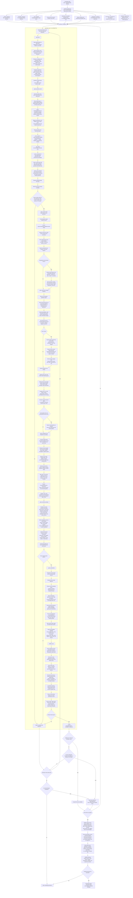

# InfiniWolf generation flow

This is the end-to-end control flow for InfiniWolf itself. It covers seeded
campaign planning, floor generation, validation, candidate selection, and the
final campaign file. 

The central rule is that randomness chooses between bounded, purposeful options.
That balance keeps seeds surprising while preserving readable spaces, fair
progression, and rewards that make exploration enjoyable. Geometry, progression
objects, actors, pickups, and decorations must still pass semantic placement
rules and validation before a floor can be selected.

```mermaid
flowchart TD
    A[CampaignConfig<br/>seed + gameplay/style settings] --> B[LittleEntropyMachine<br/>derive named blake2b deterministic streams]
    B --> B1[_variant_sequence<br/>floor material/theme identities]
    B --> B2[_circulation_sequence<br/>non-repeating building skeletons]
    B --> B3[_lock_schedule<br/>campaign gold/silver gate quota]
    B --> B4[Choose the one secret-elevator source floor]
    B --> B5[Nominate one possible overgrown floor<br/>1–2 longitudinal hallway runs]
    B --> B6[Rarely nominate one possible guard-gallery floor]
    B --> B7[_progression_sequence<br/>non-repeating macro layout grammars]
    B --> B8[6% chance: nominate one late optional<br/>hooked-cross room motif]
    B --> B9[Schedule roughly three hallway-first floors<br/>central axis, plus, T, or offset boulevard]

    B1 --> C{{For floors 1 through 10}}
    B2 --> C
    B3 --> C
    B4 --> C
    B5 --> C
    B6 --> C
    B7 --> C
    B8 --> C
    B9 --> C

    C --> D[Derive floor-attempt seed<br/>one RNG stream per subsystem]

    subgraph MAP[generate_map: one candidate floor]
        D --> E[_plan_floor]
        E --> E0[Select special family on floors 9/10<br/>independent of skeleton, districts, and motifs]
        E0 --> E1[Build mandatory spine<br/>ordinary progression, boss sequence, or reward expedition]
        E1 --> E2[Choose 2–3 districts and circulation modes<br/>double-loaded, single-loaded, suite,<br/>service-bays, formal-axis, tunnel-cluster]
        E2 --> E3[Compose progression grammar with a local<br/>detour, courtyard, service, ladder, nested,<br/>or bounded-perimeter reconvergence]
        E3 --> E4[Add filler through district rules<br/>rooms prefer shared corridor nodes]

        E4 --> F[_place_planned_rooms]
        F --> F1[Draw tier-aware sizes<br/>prefer odd doorway-axis dimensions]
        F1 --> F2[Place critical spine or centered hallway footprint<br/>apply skeleton rhythm and soft map-center pull]
        F2 --> F3[Attach suites/bays/branches to compatible circulation<br/>rehome saturated filler locally by minimum bbox growth]
        F3 --> F4[Balance asymmetric room loading; remove empty arms;<br/>drop optional rooms that cannot remain local]

        F4 --> G[Paint room floors into 64×64 tiles plane]
        G --> G1[_carve_notches + _carve_symmetric_profiles<br/>normal target 40%; chamfer, L, T, offset,<br/>stepped, and paired-bay families]
        G1 --> G2[_add_pillars<br/>rare symmetric structural pairs]
        G2 --> G3[_carve_connection for every graph edge<br/>safe portal route + protected seam fallback]
        G3 --> G4[Prefer 3-wide major halls and 1-wide connectors;<br/>otherwise widen where geometry and traffic allow]

        G4 --> H[_place_arrival_elevator<br/>one of three horizontal functional-door car arrivals<br/>with native bounded elevator geometry]
        H --> H1[Measure graph/tile depth from start]
        H1 --> H2[Select post-climax elevator candidate]
        H2 --> H3{Route contains ≥90% of the progression spine,<br/>crosses a district, and reaches ≥75% depth?}
        H3 -- no --> X[Reject candidate with ValueError]
        H3 -- yes --> H4[_place_elevator with usable native switch geometry]

        H4 --> I[Carve bespoke sealed ordinary secrets]
        I --> I1[Choose square/vault/reliquary/gallery/nested shape]
        I1 --> I2[Require unused rock shell and no normal-room connection]
        I2 --> I3[Place depth/quality-aware secret rewards<br/>3 normally; 7-item boss caches on floor 9]
        I3 --> I4[Reserve pushwall travel, rewards, and secret footprint]
        I4 --> I5{Designated secret-elevator source?}
        I5 -- yes --> I6[Require deep optional host and bespoke approach<br/>build door + two-tile car + rails + switch + rock shell]
        I5 -- no --> J
        I6 --> I7[Add symmetric in-family hint and premium rewards<br/>record host, depth, shape, destination, and return]
        I7 --> J

        J[_place_doors from seeded GatePlan]
        J --> J1[Place only mandatory gold/silver gates]
        J1 --> J2[Place each physical key as an off-route objective<br/>measured detour, no center/direct-door placement]
        J2 --> J3[Break long sightlines, split oversized sound zones,<br/>remove redundant plain doors, limit theme merges]
        J3 --> J4[Very rarely carve one mirrored guard-recess pair<br/>only when a hallway ambush can own it]

        J4 --> K{Floor 9 boss?}
        K -- yes --> K1[Prepare family-owned boss arena profile<br/>themed geometry, decoration, cover, and supplies]
        K1 --> K2[Place the boss chosen before planning<br/>Hans/Gretel key-gate a lift; the other four end the game on death]
        K2 --> K3[Stock pre-boss staging room<br/>keep post-boss victory room calm, where there is one]
        K -- no --> M[Resolve finalized room identity]
        K3 --> M
        M --> M1[Assign sound zones and district wall-material groups]
        M1 --> M2[Select jail rooms and apply explicit material families<br/>plain variants, gated damage, sparse landmarks]
        M2 --> M3[Combine role, tier, motif, district, variant,<br/>special family, material, and balanced room concept]
        M3 --> M4[Compose matched stained glass<br/>or recessed 5–9 tile pier-framed exterior vista]
        M4 --> M5{Guard-gallery floor and safe optional formal room?}
        M5 -- yes --> M6[Reserve inaccessible rear chamber<br/>seal its full visible face with matched pillars]
        M5 -- no --> L

        M6 --> L[_place_population from finalized room identity]
        L --> L1[Compute depth-based encounter budget per room<br/>floor 10 scales from its source floor]
        L1 --> L2[Choose one room squad and encounter template<br/>sentry, flank, ambush, strongpoint, objective guard]
        L2 --> L3[Reserve room loops, compact loops, and hall/door shuttles<br/>until the patrol target share is approached]
        L3 --> L4[Rank actor slots from entries, visibility, traversal,<br/>objectives, depth, and start safety]
        L4 --> L4a[Take slots in rank order, skipping any that sit<br/>inside another actor's spacing; relax when cramped]
        L4a --> L5[Record EncounterPlacement provenance<br/>place contextual dog food near actual dog packs]
        L5 --> L6[If gallery exists, add exactly two mirrored guards<br/>facing and firing through its pillar screen]

        L6 --> N[_place_authored_pickups]
        N --> N1[Translate encounter economy into intents<br/>early recovery, route ammo thinned for corpse drops<br/>except on boss floor 9, post-combat health,<br/>exploration treasure, pre-boss stock-up]
        N1 --> N2[Rank compatible rooms by route position,<br/>threat, concept, branch value, and existing vignettes<br/>floor 10 requires premium + varied expeditions]
        N2 --> N3[_PlacementGrammar chooses a named composition<br/>wall-cache, entry-staging, recovery-station,<br/>treasure-display, corner-cache, or center-dais]
        N3 --> N4[Commit atomically and record SpritePlacement provenance]
        N4 --> N5{Every required intent placed?}
        N5 -- no --> X

        N5 -- yes --> O[_place_decorations]
        O --> O1[Populate mirrored shape anchors with matching accents]
        O1 --> O2[Attempt room-concept signature]
        O2 --> O3[Choose one room lighting family<br/>compose traversal-balanced pairs and restrained frames]
        O3 --> O4[Place wall-backed appliances, armor, flags, and spears;<br/>one barrel family per room and singular blue urns]
        O4 --> O5[Check doorway clearance, statics headroom,<br/>full-map reachability, spacing, and reservations]
        O5 --> O6[On the nominated floor only, optionally fill<br/>1–2 safe hallway lengths with vines; prefer an existing ambush]
        O6 --> O7[Add corridor rhythm lights and valid niche accents]

        O7 --> P[Build GeneratedMap metadata<br/>arrival, hallway form, vista, semantic props, encounters,<br/>special rooms, walls, vines, shapes, secrets, keys, and pickups]
        P --> Q[validate_map]
        Q --> Q1[Arrival cab/player facing, connectivity, elevator,<br/>depth, bends, continuous multi-district critical route]
        Q1 --> Q2[Door axes, every gold/silver key state,<br/>physical-key detours and distinct hosts]
        Q2 --> Q3[Secret shell, push distance, no bypass;<br/>bounded car and symmetric hint for secret elevator]
        Q3 --> Q4[Encounter provenance, ambush spacing, patrol target/routes,<br/>guard-recess/gallery symmetry, ownership, and no trapped pickups]
        Q4 --> Q5[Circulation hierarchy, hallway footprint/width,<br/>occupied arms, and corridor-mediated ratio]
        Q5 --> Q6[Every in-room pickup matches one exact provenance record]
        Q6 --> Q7[Enemy codes, object limits, sound zones, vista shell,<br/>boss/reward-floor contracts, shapes and decor-family invariants]
        Q7 --> Q8{All hard checks pass?}
        Q8 -- no --> X
        Q8 -- yes --> R[_critique<br/>soft quality flags for candidate comparison]
    end

    X --> S{Attempts remain below 50?}
    S -- yes --> D
    S -- no --> S1{Any valid critiqued candidates?}
    S1 -- yes --> W
    S1 -- no --> Z[Abort campaign generation]

    R --> T{Quality tier is fast and candidate clean?}
    T -- yes --> U[Accept first clean candidate]
    T -- no --> V{Tier pool collected?
3 valid for fast fallback; 5 balanced; 8 thorough}
    V -- no --> S
    V -- yes --> W[Rank hard-valid pool: critique flags first,
then contrast with accepted floors]

    U --> Y{All ten floors accepted?}
    W --> Y
    Y -- no --> C
    Y -- yes --> Y1[Validate adjacent floor types, skeletons, and<br/>progression grammars differ; enforce hallway/vista diversity<br/>and one-floor vine, gallery, and rare-motif budgets]
    Y1 --> Y2[Permute gameplay-neutral sound-zone labels<br/>until every map has two provenance residues;<br/>ten primary residues total 42 modulo 43]
    Y2 --> AA[Write deterministic MAPINFO, manifest,<br/>plain-text reproduction settings, and ten ECWolf map WADs<br/>to a temporary campaign file]
    AA --> AB[validate_package<br/>reopen archive, verify entries, headers,<br/>dimensions, manifest, and asset-free contents]
    AB --> AC{Package valid and not cancelled?}
    AC -- no --> Z
    AC -- yes --> AD[Atomically replace requested output<br/>with validated InfiniWolf campaign]
```

## Determinism and shared reservations

`LittleEntropyMachine` derives the named campaign and floor-attempt seeds with
blake2b; those payload-name strings are a frozen compatibility contract. The
floor generator then builds one `random.Random` per subsystem from
`subsystem_seed(floor, attempt, name)`, over the eight names in
`FLOOR_STREAM_NAMES`: planning, geometry, progression, semantics, encounters,
pickups, decorations, special_floors. Neither the named campaign streams nor the
per-subsystem floor streams can perturb one another, so a subsystem can be
tuned without moving anything else on the floor. Those eight names are in the
seed payload and are frozen for the same reason.

`ledger.Ledger` records every claim made for a cell rather than replacing an
earlier claim. A cell stays reserved until its final claim is released, and
`release(cells, owner, reason)` removes claims belonging to that owner while
leaving every other owner's claim in place.

## How to read the failure paths

- A `ValueError` inside `generate_map` rejects only that `(floor, attempt)`.
  The floor is regenerated from a different deterministic attempt seed.
- Hard validation is non-negotiable. A candidate with broken progression,
  untracked pickups, shallow exit placement, or invalid secrets cannot enter
  the soft-quality pool.
- `_critique` is intentionally softer. `fast` accepts the first clean candidate,
  with a three-valid-candidate fallback; `balanced` ranks five valid candidates
  and `thorough` ranks eight. Ranking uses critique-flag count before contrast
  with accepted floors, so a contrast gain cannot buy off a concrete flag.
- Cancellation and file installation are atomic: an incomplete or invalid
  temporary campaign never replaces the user's existing output.

## Placement responsibility

Each output below has exactly one module that decides it. The module list is the
architecture; the table is who owns which decision within it.

| Module | Owns |
| --- | --- |
| `wl6.py` | The native WL6 code vocabulary. No imports; every other module builds on it |
| `model.py` | Record types more than one system reads |
| `grid.py` | Structure queries: what is at a cell, what can be walked to, how rooms connect |
| `campaign.py` | Ten-map scheduling (attempt-invariant) and candidate ranking |
| `planning.py` | The abstract building program, before any tile exists |
| `geometry.py` | General structural realization: reusable room painting, corridor routing, repair passes, and space partitioning |
| `progression.py` | Elevators, doors, locks, keys, secrets — whether the floor can be finished |
| `semantics.py` | `RoomIdentity` and wall treatment — what each space means |
| `encounters.py` | Room-owned combat composition and patrols |
| `pickups.py` | Economy compositions and the ammo budget |
| `decorations.py` | Aesthetic prop composition |
| `special_floors.py` | Floor 9 and 10 authored contracts |
| `quality.py` | Soft critique; cannot reach validation |
| `generator_validation.py` | Hard validation. Non-negotiable, raises |
| `generator_artifacts.py` | WAD/PK3 encoding and package verification |
| `generator.py` | Phase order, floor-seed derivation, and the `boss_locks_exit` / `boss_ends_floor` integration seam |

| Building circulation | `_plan_floor` + `_place_planned_rooms` | Skeleton or hallway-first form, district mode, corridor width, occupied arms, suite/branch role |
| Floor arrival | `_place_arrival_elevator` | Horizontal axis, complete working-door car, contextual item, player position and facing |
| Elevator and keys | exit/gate planners | Mandatory route depth, explicit key states, meaningful physical-key detours |
| Secret rooms/elevator | `_place_secret` / `_carve_secret_pocket` | Isolated shape, pushwall entrance, reward tier, bounded elevator car |
| Enemies | `_place_population` | Room identity, encounter template, squad family, reveal slot, facing or patrol route |
| Guard recesses | `_carve_guard_recesses` + encounter planner | Rare mirrored hallway pair and its owned blind-corner sentry |
| Guard gallery | `_place_guard_gallery` + gallery encounter planner | Optional symmetric room, complete matched screen, inaccessible pickup-free rear chamber, owned firing pair |
| Wall materials | `_assign_area_themes` + `_apply_wall_theme` | Compatible district family, room identity, coherent variant/damage/landmark, validated special composition |
| Exterior vista | wall-special planner | Odd recessed span, original-plane piers, deeper sky, solid backing, campaign repetition budget |
| Hallway vines | campaign schedule + `_place_decorations` | Single nominated floor, complete longitudinal run, same-path budget, optional existing ambush anchor |
| Gameplay pickups | `_place_authored_pickups` + `_PlacementGrammar` | Economy intent, owning room, named composition, exact provenance |
| Room decoration | `_place_decorations` | Room identity, one lighting and barrel family, singular urn rule, architectural anchor, composition, reachability |
| Ambient lighting | `_place_decorations` Stage B | Every room lit, one fixture family per room, 3–4 tile lattice spacing, allocated before furniture spends the statics budget |
| Density fill | `_place_decorations` Stage C | Cell geometry (corner/nook/slot/wall/free) chooses the item from the mined corpus distribution, corner-first, concept-eligible only, spaced except for barrels, reachability re-checked |
| Floor lamps | `_place_decorations` lamp gate + corner snap | Never on a cell with floor on all four sides, never abutting another lamp, at most two per room; matched pairs allowed from any composition, singles only from the corner snap |
| Matched compositions | `_place_decorations` group commit | Cells committed as one multi-cell group are exempt from the flush-to-wall repair, so a pair cannot be pulled apart |
| Room motif | `_choose_motif` | Exactly one composition per room, chosen from those structurally eligible and weighted inversely to how widely each applies; 18% of eligible rooms deliberately plain |
| Room concept | `semantics` + `CONCEPT_AFFINITIES` | Repels a neighbour's concept first, then attracts a functional partner, then balances counts |
| Landmark hierarchy | `plan_landmarks` | One primary and up to three secondaries per floor, never graph-adjacent, chosen before decoration from geometry alone |
| Aesthetic arc | `aesthetic_phase` | Bounded per-floor multipliers; floors 9 and 10 pinned; modulates a variant, never replaces it |
| Cell reservations | `ledger.Ledger` | Claims accumulate per cell with owner and reason; the cell remains reserved until its final claim is released, and `release` removes only the calling owner's claims |
| Candidate selection | `campaign._best_candidate` | Ranks only hard-valid maps, flag count dominating contrast, pool size set by `generation_quality` |
| Shared void | `carve_shared_void` | One per campaign at most; interior rock pocket overlooked by two or more rooms, sealed by a complete pillar screen, containment proved with the screens blocked, no pickups or actors inside |
| Authored view | `plan_authored_sightlines` | The line ahead from a primary landmark's approach doorway, reserved so no prop fills it, truncated at anything already solid |
| Floor 9 boss gate | `campaign.choose_boss` + `planning` + `progression` + `validate_map` | Boss resolved before the floor is planned. Gold-locked elevator when he drops a key and the arena is a cut vertex; when he calls `A_BossDeath` the floor is planned with no victory or exit room, carries no elevator paneling, and its critical route ends at the arena |
| Hallway furnishing | `_place_decorations` area gate | Rooms are skipped by floor area (< 20 cells), not by minimum dimension, so three-wide corridors are furnished along their flanking lanes; the centre lane of any room three cells across is reserved outright, since reachability still validates a plugged corridor |
| Symmetric room profiles | shape carvers + `_place_decorations` | Bounded mirrored structure and matching themed accents |

The long-term rule is simple: if a sprite or structural feature cannot answer
“why is this here?”, it does not belong in a selected floor. Coherence is what
lets variety stay fun instead of becoming noise.
