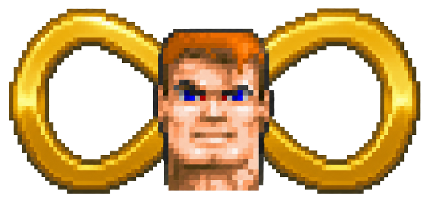

<div align="center">

<h1>InfiniWolf</h1>



<p>
  <a href="https://github.com/voidnullvalue/InfiniWolf/actions/workflows/release.yml"></a>
  <a href="https://github.com/voidnullvalue/InfiniWolf/releases/latest"></a>
  <a href="https://github.com/voidnullvalue/InfiniWolf/releases"></a>
  <a href="LICENSE"></a>
  <a href="https://www.python.org/downloads/"></a>
</p>

</div>
InfiniWolf generates deterministic ten-map Wolfenstein 3D campaigns for ECWolf, with varied building layouts, coherent room themes, staged progression, and context-aware encounters and rewards. Independent progression grammars, circulation skeletons, scheduled hallway-first forms, district patterns, reconvergence motifs, and asymmetric room profiles prevent one repeated generator silhouette from owning the campaign. Every floor begins at one of three believable, complete, rock-bounded horizontal elevator-car arrivals, each with a real working door. District-aware stone, brick, wood, metal, marble, plaster, and damaged wall families give rooms a stronger sense of place, with purple reserved for floors 6–10 as a late-campaign escalation. Recessed exterior vistas and room-semantic prop families add visual character without exposing the map shell or scattering arbitrary clutter. Room-owned sentries, flanks, ambushes, strongpoints, moving patrols, and rare firing galleries make combat spaces feel purposeful. The goal is simple: make each seed fun to explore and enjoyable to replay, building toward one of five geometry-rich boss strongholds on floor 9 and a secret reward expedition on floor 10. It uses the player's registered WL6 data at runtime and never copies Wolfenstein graphics, sounds, music, or data files into generated packages.

Curious how the generator actually works? Start with the human-readable
[`GENERATION_FLOW.md`](GENERATION_FLOW.md) flowchart, then use
[`DESIGN.md`](DESIGN.md) for the detailed floor grammar, room realization,
actor placement, and validation rules.

## Prebuilt release (Windows / macOS / Linux)

Every tagged release publishes a self-contained `.zip` per platform on the [Releases page](https://github.com/voidnullvalue/InfiniWolf/releases) — no Python install required. Each one bundles:

- `InfiniWolf` — the desktop generator (double-click to run)
- `infiniwolf-cli` — the same generator as a command-line tool
- ECWolf itself (the **GPL edition**; see [Licensing](#licensing) below), so there's nothing else to install

To use it: download the archive for your platform, unpack it, and drop its contents next to (or into) your own registered Wolfenstein 3D install — you still need to supply your own legally owned WL6 data; nothing here includes or downloads it for you. Run `InfiniWolf`, choose settings, **Generate**, then **Play**.

Prefer to run from source, or want to build these packages yourself? See below.

## Requirements

- Python 3.11 or newer
- ECWolf
- Registered Wolfenstein 3D WL6 data
- Tkinter for the desktop interface

## Desktop interface

```sh
python3 run.py
```

The first launch attempts to find ECWolf and WL6 data automatically. Confirm the paths, choose generation settings and an optional seed, then select **Generate**. Once validation succeeds, select **Play**.

After generation, **View Maps** opens a scalable top-down viewer for all ten
maps. The floor list and optional start/exit, route, enemy, pickup, and secret
overlays make it possible to inspect a campaign without launching ECWolf.
The window title and footer show the exact InfiniWolf version and abbreviated
Git commit, making screenshots and bug reports straightforward to identify.

When the tool detects the `/data`, `/mods`, and `/games` layout used by this collection, it installs to `mods/installed/infiniwolf/infiniwolf.pk3` automatically. The campaign will then also appear in the collection's normal mod selector.

## Command line

```sh
python3 -m infiniwolf --seed castle --output infiniwolf.pk3
```

Run `python3 -m infiniwolf --version` to print the same version and commit
identifier shown by the desktop interface. Normal CLI runs print it before
generation as well.

Every intensity option accepts `1` through `5`:

```sh
python3 -m infiniwolf --seed 42 --guard-density 4 --enemy-toughness 3 \
  --supplies 3 --treasure 2 --secrets 4 --locked-doors 3 \
  --layout-complexity 5 --decoration-amount 4 --room-shape-variation 4 \
  --patrol-activity 3 --atmosphere 2 --secret-reward-quality 4 \
  --theme-bias catacombs --output infiniwolf.pk3
```

The desktop interface groups the original gameplay controls separately from
the style controls. Style settings deliberately influence bounded choices
rather than disabling map validation: decoration amount controls prop budget,
room-shape variation controls a target mix of chamfers, L/T profiles, offset bays,
mirrored notches, and symmetric profiles (40% shaped rooms at the normal setting), patrol activity controls
the target share of actors assigned to validated moving routes, atmosphere controls
how clean or grim rooms look, and secret
reward quality shifts the secret-room reward mix. Theme bias strongly favors a
floor identity without forcing every floor to repeat it; `mixed` keeps the
default rotating sequence. Adjacent floors are guaranteed to use different
base identities and different circulation skeletons. Layout complexity now
scales planned room count through 16/18/20/22/24 rooms; saturated optional
fillers try another nearby host in the same district, increasing the number of
distinct rooms without enlarging their dimensions or creating remote corridors.
Floor 10 plans up to four additional expedition destinations within the same
24-room ceiling to compensate for its larger room footprints.
About three floors per campaign may instead begin from a hallway-first form:
a central axis, plus, T, or offset boulevard. These forms use broad major
hallways, narrow connectors, balanced asymmetric room loading, and no empty
arms; ordinary graph-first floors remain the majority. Decoration also keeps
blue and green barrels in separate room-level families and treats blue urns
as singular wall-backed accents rather than loose repeated clutter.

Using the same version, commit, seed, and settings produces byte-identical output. The named `LittleEntropyMachine` seed source derives independent floor, variant, circulation, progression-grammar, lock, vine-sector, rare-gallery, and rare-motif streams without retry attempts perturbing campaign-scale choices. A manifest inside the PK3 records that seed source, the resolved seed and settings, arrival elevator, circulation or hallway form, exterior vista, semantic prop families, wall and room identity, encounter compositions, patrol routes, the single-floor corridor-vine schedule, rare guard galleries, special-floor family, room shapes, lighting families, key objectives, bounded secrets, pickup compositions, and validation results. Every generated PK3 also includes `infiniwolf-settings.txt`: a plain-text record of the exact version, commit, resolved seed, every control value, and a copyable reproduction command.

Generated maps also carry a gameplay-neutral provenance signature in their
sound-zone numbering. Each standalone `IWNN.wad` has two independently
checkable residues; all ten primary residues additionally total 42 modulo 43.
The signature is bound to zone layout, door geometry, and selected ordinary
map objects, so removing a metadata file is insufficient and broad edits tend
to invalidate it. Check a campaign or one extracted map from either CLI or an
optional GUI:

```sh
python3 tools/check_infiniwolf.py campaign.pk3
python3 tools/check_infiniwolf.py maps/iw05.wad
python3 tools/check_infiniwolf.py renamed.wad --floor 5 --json
python3 tools/check_infiniwolf.py --gui
```

This is evidence of generator origin, not cryptographic proof of authorship;
someone deliberately re-encoding a copied map can forge it.

## Tests

```sh
python3 -m unittest discover -s tests -v
```

Broader deterministic fuzzing and a real-engine smoke check are also included:

```sh
python3 tools/fuzz.py --seeds 1000
python3 tools/smoke_ecwolf.py --ecwolf /path/to/ecwolf --data /path/to/wl6-data
```

Generated packages contain only WAD map data, MAPINFO, and reproducibility metadata. Registered WL6 assets remain in the user's data directory.

## Building a release locally

`.github/workflows/release.yml` tests each push to `main`, creates the declared
`vX.Y.Z` tag when that commit is still current, and then builds and publishes
the three platform packages. A manually pushed version tag follows the same
test/build/publish path (see `packaging/make_release.py`). To reproduce a
package by hand:

```sh
pip install pyinstaller .
pyinstaller --onefile --windowed --name InfiniWolf run.py
pyinstaller --onefile --name infiniwolf-cli infiniwolf_cli.py
python3 packaging/make_release.py --platform linux --version 1.8.0   # or windows / macos
```

The script downloads ECWolf's official prebuilt binary for the target platform from `maniacsvault.net`, checks it against a pinned SHA-256, and packages it alongside the two executables. It never touches Wolfenstein 3D game data.

## Licensing

InfiniWolf itself is MIT licensed (`LICENSE`). ECWolf is dual licensed by its authors under either the original id Software non-commercial license or GPLv2+; `packaging/make_release.py` only ever fetches and bundles the **GPL edition** (verified against ECWolf's own bundled `readme.1st`/license files, and against the fact that the Linux build is literally the Debian-archived package, which cannot legally carry the non-commercial edition). Prebuilt release packages include ECWolf's GPL license text and copyright notices under `THIRD_PARTY_LICENSES/ecwolf/`. ECWolf's source is at [github.com/ECWolfEngine/ECWolf](https://github.com/ECWolfEngine/ECWolf).

## Credits

Señor Frijole — testing and map-design feedback.
