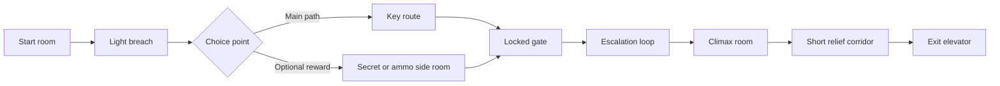
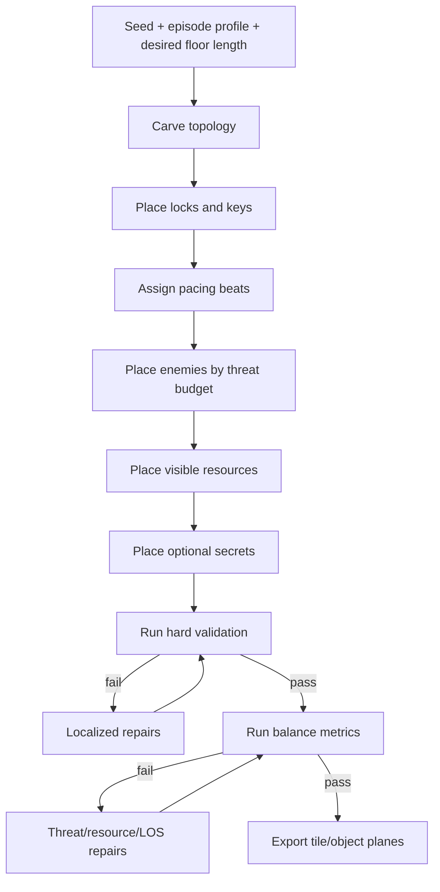

# Wolfenstein 3D Level Quality and Balance for Automated Generation

## Executive summary

A “good” classic **Wolfenstein 3D** level is not primarily a maze, nor primarily a sandbox. It is a **legible sequence of door-delimited combat cells**, short orthogonal connectors, optional reward branches, and conservative key gating that fits the original engine’s hard limits: a **64×64 map**, **37 floor areas**, **64 sliding doors**, **150 actors**, **400 statics**, and **64 wall tiles**. The engine’s geometry is fundamentally constrained to same-height, orthogonal wall blocks on a square grid, so balance comes less from complex architecture and more from **where doors, corners, offsets, sightlines, and enemy types are arranged**. citeturn41view0turn41view1turn41view2turn43view0turn43view1

For automated generation, the most important design rule is that **routine combat should happen mostly inside reliable ballistic ranges**. In the original game, player gunfire is strong at close range, degrades sharply with distance, and becomes impossible beyond about **21 tiles**; the manual also advises the player to fight at close range, enter rooms from an angle, and avoid rushing straight through doors. That means good generated levels should usually hold important firefights in about **3–12 tiles** of unobstructed line of sight, use **offset doors and corners** to create peekable attacks, and reserve **15–21-tile lines** for rare spectacle corridors or optional set-pieces rather than mandatory attrition fights. citeturn19view0turn22view3

Fairness in Wolf3D also has unusually clear original guidance. The manual explicitly says **necessary items are not hidden**, keys are on the same level as the locked doors they open, and hidden passages are a source of extra ammo and health rather than core progression. That is extremely useful for a generator: **do not put mandatory progression behind secrets**, keep keys on readable side branches, and treat secrets as optional surplus or shortcuts. Community documentation on original maps shows that when this rule is violated, such as the famously hostile **Episode 2, Floor 2** mandatory-secret case, the level is remembered as unfair rather than elegant. citeturn22view0turn22view3turn38search3

For a final logic pass, the best implementation strategy is to treat generation as a sequence of **hard validation rules**, then a smaller set of **threat-budget and resource-solvency repairs**. Validate connectivity, non-secret main progression, engine limits, and line-of-sight thresholds first. Then solve local balance with targeted edits: downgrade or move an SS, widen a corridor from 1 tile to 2, add an offset corner, insert a visible clip before a mutant introduction, or move a key from a secret to a visible side room. The final pass should be able to explain every fix in terms of **engine mechanics, original map practice, or manual guidance**. citeturn28view3turn29view4turn18view0turn22view3

## Assumptions and engine realities

This report assumes a **classic DOS-like Wolf3D rule set** with the original tile grid, original sprite AI logic, original door behavior, original damage formulas, and original episode-style progression. If your pipeline targets **ECWolf, LZWolf, Jaguar/SNES-derived ports, or custom source mods**, treat several details here as variant-sensitive: pushwall behavior, some item semantics, ammo semantics on ports, and certain bug quirks differ outside vanilla. Those variant choices were **not specified** in the request, so where behavior differs by port, this report calls that out rather than guessing. citeturn24search3turn24search10turn43view1

At the data-structure level, original Wolf3D maps are **64×64 tile grids** with a wall/door layer and an object layer for player start, enemies, items, and bonuses. The world is strictly orthogonal: walls are same-height blocks, intersections are rectangular, and the engine does not support stairs, height changes, or room-over-room geometry. These are not cosmetic details; they are the reason main-path readability, area partitioning, and line-of-sight control matter so much more than in later id engines. citeturn41view0turn43view0turn43view1

The original source code also exposes the limits that matter most to a procedural pipeline. The engine caps maps at **64×64**, uses **37 area IDs** for connectivity logic, allows at most **64 sliding doors**, **150 actors**, and **400 statics** such as lamps, treasure, and bonus objects. The same header also fixes the starting ammo constant at **8**, and the new-game initialization sets the player to **100 health**, **pistol**, **8 ammo**, and **3 lives**. A generator that does not track those budgets can easily output maps that are valid “on paper” but unstable or unplayable in an authentic implementation. citeturn41view0turn41view1turn41view2turn41view3turn41view4turn42view0turn42view1turn42view2

Doors matter mechanically, not just visually. In the original source, a door opening **connects adjacent areas**, a door remains open for **300 tics** with the code comment “Close the door after three seconds,” and when the door closes it disconnects those areas again. This means your level logic should think in terms of **combat and sound partitions**: too many tiny door-separated regions can exhaust area IDs or produce brittle AI activation patterns, while too few doors flatten pace and remove Wolf3D’s signature “room-by-room breach” rhythm. citeturn28view0turn28view2turn28view3turn5view0

Pushwalls also matter mechanically. The original pushwall code increments the pushed wall forward and stops once “the block has been pushed two tiles,” unless blocked earlier. In vanilla-compatible play and community documentation, secret-wall overtravel and secret blocking can still create awkward or even broken outcomes in some versions or framerate conditions, so a generator should **backstop every rewarded pushwall with a known stopping condition** rather than assuming secrets are harmless. citeturn29view4turn24search3turn24search10

## Geometry, flow, readability, and secrets

Representative original maps show the dominant Wolf3D grammar clearly: **orthogonal rooms joined by short halls, doors at room thresholds, a readable main route, optional side pockets, and secrets tucked just off the critical path**. Episode 1 Floor 1 is practically a tutorial in door-separated escalation and optional secret reward, while Episode 2 Floor 2 shows how the same grammar becomes harsher when key routing, early pressure, and poor visible health are combined. citeturn36image0turn36image1turn37image0turn38search3

iturn36image1turn37image0turn36image0turn37image1

The most robust room-and-corridor defaults for generation are these:

| Element | Recommended baseline | Hard floor | Soft floor | Why |
|---|---:|---:|---:|---|
| Main room size | 5×5 to 11×11 walkable | 4×4 | 13×13 | Enough room for enemy separation, dodging, landmarks |
| Small side room / closet | 2×2 to 4×4 | 2×2 | 5×5 | Good for pickups, single ambush, secrets |
| Default corridor width | 2 tiles | 1 tile | 3 tiles | 2 tiles is the safest “Wolf-like” default |
| One-tile corridor usage | ≤ 25% of traversed path | 0% on start route | 35% | Reserve for tension, not most of navigation |
| Straight corridor length | 4–12 tiles common | 3 | 18 | Longer sightlines need explicit intent |
| Doors between major cells | 1 per room transition | 0 | 2 chained max | Supports pacing without exhausting door/area budget |
| Keys on a level | 0–2 typical | 0 | 3 with caution | Gold/silver only; overuse hurts readability |

These recommendations are synthesis, but they follow directly from the engine’s orthogonal tile world, the original maps, and the manual’s emphasis on angled entry, peeking, and close-range fighting. citeturn43view0turn43view1turn22view3turn36image0turn37image0

**Corridor width** is one of the highest-value generator choices. The engine allows 1-tile corridors, but because combat is tile-based, doors open into a single lane, enemies path by tile selection, and officers/dogs rush fast, overusing 1-tile halls makes the map feel sticky, door-campy, and over-deterministic. Use **2 tiles as the default width**, allow **1-tile halls** only for short connectors, secret runs, or deliberate pressure bursts, and use **3-tile halls** only for hub junctions or late-game spectacle spaces. The manual’s “Don’t Rush Into the Room!” and “Get at an Angle” advice is effectively a warning against perpendicular, single-lane breach traps becoming the entire map. citeturn16view1turn16view2turn22view3

**Sightline heuristics** should be explicit in code. Because player bullets degrade hard with distance and become impossible past roughly **21 tiles**, the logic pass should classify sightlines like this:

| Sightline length | Use |
|---|---|
| 1–3 tiles | melee or point-blank breach only; dangerous if hitscan enemies are centered |
| 4–8 tiles | ideal routine engagement length |
| 9–12 tiles | good midrange pressure band |
| 13–18 tiles | set-piece or high-readability lane; needs cover or door segmentation |
| 19–21 tiles | rare spectacle / optional lane only |
| 22+ tiles | avoid for mandatory combat; player cannot hit |

This thresholding follows directly from the original damage and hit formulas plus the manual’s close-range guidance. In practice, it means the final pass should measure straight unobstructed tile runs from **door thresholds**, **spawn room exits**, and **critical-path nodes**, then add bends, pillars, or alcoves where those values exceed target bands. citeturn19view0turn22view3

Flow should also be segmented, not amorphous. A strong Wolf3D floor usually reads as **onboarding → first branch → first key or weapon relief → escalation loop → climax → short exit run**. Branching is best when it is **shallow but meaningful**: let the player choose between reward, progress, or information, but avoid branching so evenly and symmetrically that rooms blur together. This is one reason E1F1 still reads well: it branches enough to feel exploratory, but not enough to become a maze. citeturn9view0turn36image0



That structure matches both original manuals and original maps: keys and elevators are on the normal route, while secrets supply optional advantage, score, or shortcuts. citeturn22view0turn22view3turn9view0turn9view1

A practical **backtracking rule** for generation is: allow **10–35% critical-path overlap** after the first key, but if backtracking exceeds that, either create a loop or ensure that the return trip is meaningfully recontextualized by new enemy activation, a second lock, or a visible reward. Long pure retraces are especially bad in Wolf3D because the engine offers little vertical or systemic variation to keep revisits fresh. Maps like **Episode 6 Floor 8**, which have very long pars, show that long duration can work, but only when structure, theme, and escalation remain legible. citeturn38search12turn36image1turn37image0

Aesthetic readability matters more than many procedural systems assume. Because walls are same-height and intersections are rectangular, the player orients through **texture zones, room silhouette, door offsets, statics, and reward placement**. A room that is a tiny square with doors on all sides can be memorable, but it is also intrinsically disorienting because landmarks disappear; Liz Ryerson’s level analysis of an original map is excellent evidence that “strange” rooms can create atmosphere yet also destabilize the player’s spatial memory. For a generator, that means anomaly rooms should be **rare accents**, not default junctions on the main route. citeturn40view0

Secrets should follow the manual’s implied contract: they are **optional value**, not mandatory infrastructure. Good secret budgets are usually **2–6 per standard floor**, with at least one practical reward secret and at least one flavor/score secret. Recommended secret reward balance is **15–35% of total optional resources** on the map, while the non-secret route remains fully solvable. Use subtle but detectable telegraphing: off-pattern eagles, suspicious dead-end panels, treasure “teasers,” or slightly anomalous wall runs. Place a **hard backstop exactly two tiles** behind important pushwall rewards so original pushwall motion cannot seal or overshoot the reward. citeturn22view0turn22view3turn29view4turn24search3turn35search16

## Enemies, items, and progression

The table below uses original enemy behavior as documented in the manual, source-backed community references, and the source release. The numerical stats are factual; the **threat weights** and **placement rules** are recommended synthesis for procedural generation. citeturn18view0turn19view1turn22view2

| Enemy | Canon stats and behavior | Suggested threat weight | Recommended placement heuristic |
|---|---|---:|---|
| Guard | 25 HP; pistol; drops used clip worth 4 ammo; common baseline enemy. citeturn18view0turn34view1 | 1.0 | Use in groups of 2–5. Good behind first doors, side rooms, and visible patrol lanes. Safe default filler. |
| Dog | 1 HP; melee only; fastest enemy; patrol only, no standing spawn. citeturn18view0 | 0.5 | Use 1–3 at a time, especially mixed with humans. Strong as door rushers or corridor pressure. Avoid using large dog-only swarms. |
| Officer | 50 HP; pistol; faster reaction and lateral movement than guards. citeturn18view0 | 1.75 | Use 1–2 early, 2–4 late with cover. Dangerous in narrow halls; never stack many in immediate spawn LOS. |
| SS | 100 HP; machine gun bursts; very high burst threat; drops machine gun or used clip. citeturn18view0 | 3.0 | Use 1–2 in routine play, 3 only in larger rooms or offset cover. Highest regular priority target. |
| Mutant | 45/55/55/65 HP by difficulty; rapid double shot; silent alert; poor surprise fairness if under-supplied. citeturn18view0 | 2.25 | Introduce with visible ammo nearby and cover. Use in corners and offset approach lanes, not as surprise frontload in pistol-starved starts. |
| Boss | Usually ambushes, always face player, do not behave like regular fodder. citeturn18view0 | 8–15 | Opt-in only. Boss floors should simplify layout and raise arena clarity rather than add maze complexity. |

Two original-mechanics details should drive your AI-aware placement rules. First, non-boss regular enemies can be **standing or patrolling**, except dogs, which are patrol-only. Second, some enemies can be flagged **ambush**, in which case they ignore weapon noise and only engage on direct sight. Bosses are effectively always treated as ambushes for activation purposes. Those flags are a gift to procedural generation: use ordinary patrols for readable pressure, and use ambush sparingly to create **earned** surprises rather than constant unfairness. citeturn18view0turn41view0turn31view3

The original source also shows why geometry and AI cannot be separated. Enemies choose tile directions toward the player, open doors during movement, and resolve pursuit through tile-based chase selection. Closed doors reconnect/disconnect areas, which changes how broadly enemies can become active. In other words, a “combat encounter” in Wolf3D is partly a room composition problem and partly an **area-partition and door-threshold problem**. citeturn16view1turn16view2turn28view0turn28view2

For automated placement, a simple threat-budget model works well:

- **Guard** = 1.0
- **Dog** = 0.5
- **Officer** = 1.75
- **Mutant** = 2.25
- **SS** = 3.0
- **Boss** = 8.0–15.0 depending on arena and support enemies

Then target zone budgets like these:

| Episode band | Typical major-zone budget | Density target |
|---|---:|---:|
| Early Episode 1 | 2–4 threat | 0.03–0.05 enemies / walkable tile |
| Late Episode 1 to early Episode 2 | 4–6 threat | 0.05–0.07 |
| Late Episode 2 to Episode 3 | 5–8 threat | 0.06–0.08 |
| Episodes 4–5 | 6–10 threat | 0.07–0.10 |
| Episode 6 | 7–12 threat | 0.08–0.12 |

Those values are synthesis, but they are consistent with the original episode introductions, the roster rollout in the manual, and late-map examples such as **Episode 6 Floor 1** with **137 enemies** and **Episode 6 Floor 9** being remembered as a map in which many enemies hear you at once. Treat those late originals as upper-bound stress tests, not as your default output. citeturn22view2turn38search8turn38search0

The table below covers items, pickups, and recommended placement logic. As above, the item effects are factual; the right-hand placement rules are guidance for generation. citeturn22view1turn34view0turn34view1turn34view2turn34view3turn35search1turn35search3turn35search4turn35search2

| Item | Canon effect | Baseline generation rule | Secret generation rule |
|---|---|---|---|
| Dog food | +4 health. citeturn35search1 | Use as light correction after dogs or chip damage. | Fine in dog-themed closets or low-tier secrets. |
| Food | +10 health. citeturn22view1turn35search3 | Default visible heal. Place every 1–2 light fights. | Good in exploration side rooms. |
| First aid | +25 health. citeturn22view1turn34view0 | Place before or after a defined spike, or in visible side room near key path. | High-value secret reward. |
| Blood/gibs | +1 health only at low health. citeturn35search4 | Do not rely on for balance. Flavor only. | Fine as incidental flavor. |
| Ammo clip | +8 ammo from map; +4 when dropped by gunners. citeturn22view1turn34view1 | Baseline resource unit. Place before new enemy-type spikes and after ammo-negative groups. | Excellent practical secret reward. |
| Machine gun | Weapon upgrade; practical DPS increase. citeturn22view1turn22view0 | Put one early if floor can start from pistol. | Strong secret reward on early floors. |
| Chaingun | Best standard weapon; strong room-clear tool. citeturn22view0turn22view1 | Use sparingly; mid/late floor payoff or hard secret. | Premium secret reward. |
| Key | Gold or silver; unlimited uses for matching locks. citeturn34view2turn22view0 | Must be on visible, normal route or obvious side branch. Never secret-gated. | Usually avoid hiding. |
| Treasure | 100/500/1000/5000 score depending on type. citeturn22view1turn35search2 | Use to guide optional exploration and theme rooms. | Core secret filler. |
| One-up | Full health, +25 ammo, extra life; secret-only in original games. citeturn22view1turn34view3 | At most one per standard floor, and usually not visible on main path. | Best capstone secret reward. |

For **ammo budgeting**, treat enemies as “expected bullet sinks” rather than raw HP only. Using the original damage formulas, guards are cheap to kill at close range, officers and mutants are moderate, and SS become expensive if engaged from mid-long range. A practical conservative model for routine 3–8-tile fights is:

- Guard: **1.5 bullets**
- Dog: **0.25 bullets** if you expect knife play, otherwise **1.0**
- Officer: **3 bullets**
- Mutant: **3 bullets**
- SS: **6 bullets**

Then compute:

```text
expected_ammo_need =
    1.5*guards +
    dog_cost*dogs +
    3.0*officers +
    3.0*mutants +
    6.0*ss
```

and require:

```text
accessible_ammo =
    start_ammo +
    8*(placed_map_clips) +
    4*(conservative_gunner_drops) +
    25*(full_heals if counted as ammo source)
```

with a target of **accessible_ammo ≥ 1.2 × expected_ammo_need** for a normal floor and **≥ 1.35 × expected_ammo_need** for a standalone, pistol-start floor. The underlying reasons are original: map clips give 8, dropped clips give 4, the player starts a new game with a pistol and 8 rounds, and long-range fire gets progressively inefficient. citeturn34view1turn42view0turn19view0

For **health budgeting**, Wolf3D benefits from local rather than global rules. Use these:

- Put the **first visible heal** within **20 traversed tiles** of a pistol-start spawn.
- After any combat zone with **threat ≥ 6**, ensure there is either **+10 to +25 visible healing** within **12 tiles** or a nearby safe side room.
- Do not let the first encounter with a new high-tier threat be both **ammo-negative** and **heal-negative** unless the level explicitly aims to mimic infamous original punishment maps. citeturn22view1turn34view0turn38search3

Across episodes, follow original roster progression rather than randomizing all enemies from the start. The manual gives the cleanest episode-level cadence: Episode 1 focuses on guards, SS, and dogs; Episode 2 adds mutants; Episode 3 adds officers; Episodes 4–6 remix the same tools into harsher Nocturnal Missions with denser, meaner compositions. That rollout is valuable because it teaches both pace and counterplay. citeturn22view2

## Prioritized checklist

The checklist below is ordered for a **final logic pass**. The items at the top are hard failures or near-hard failures under authentic Wolf3D assumptions; the lower items are quality or polish constraints derived from the same engine and level-design sources. citeturn41view0turn41view1turn41view2turn19view0turn22view3

1. **Main progression is fully solvable without secrets.** Keys, locks, and the exit must be reachable through non-secret paths. This is the single highest-priority fairness rule.  
2. **Map stays under engine hard limits.** Enforce: map 64×64, areas ≤ 37, doors ≤ 64, actors ≤ 150, statics ≤ 400, wall tiles ≤ 64. Prefer soft caps below those.  
3. **Start condition is validated against the intended loadout profile.** At minimum test a fresh-episode pistol start. If the level is for carryover play, test at least one weak carryover profile too.  
4. **Critical-path sightlines are within target bands.** Routine mandatory fights should occur mostly at 3–12 tiles, rarely above 18, never depend on >21-tile engagements.  
5. **No unavoidable instant-death door reveals.** If a door breach opens into officers, mutants, or SS, the first high-tier shooter must be offset laterally or set back.  
6. **Keys are placed on readable branches.** No hidden key, no same-color self-locking, no giant retrace to discover the only usable branch.  
7. **Ammo solvency passes conservative estimates.** Use expected bullet sinks, visible clips, and conservative drops.  
8. **Healing is paced locally, not just totaled globally.** Every spike must have a nearby recovery opportunity or safe reset pocket.  
9. **One-tile corridors are rationed.** Default to 2 tiles; use 1-tile halls deliberately and briefly.  
10. **Room silhouettes and textures create landmarks.** Every major branch or key node needs a visual identity.  
11. **Secrets are optional surplus, not hidden chores.** Aim for 2–6, with practical and score rewards mixed.  
12. **Pushwall secrets are backstopped.** Two-tile pushwall logic must not jam or seal rewards.  
13. **Backtracking is purposeful.** If overlap exceeds roughly one-third of the critical path, add a loop, a reveled shortcut, or fresh context.  
14. **Enemy introductions respect episode learning.** Do not frontload mutants or clustered SS on a pistol-starved new-player floor unless you intentionally want a tribute to punitive originals.  
15. **Soft performance headroom remains.** Ideal final values: areas ≤ 32, doors ≤ 56, actors ≤ 120, statics ≤ 320.

## Evaluation metrics

For code, treat “good and balanced” as a measurable property set, not a vague aesthetic label. The thresholds below are intentionally conservative; they are suitable for a **repair pass** that should reject or auto-fix marginal outputs instead of shipping them. The thresholds are derived from the engine limits, ballistic formulas, original-map routing patterns, and the original manual’s progression contract. citeturn41view0turn41view1turn41view2turn19view0turn22view0turn22view3

| Metric | How to compute | Target | Hard fail | Typical auto-fix |
|---|---|---|---|---|
| Non-secret solvability | BFS over non-secret doors/floors from start to exit with keys collected normally | True | False | Move key/exit/lock off secret path |
| Area count | Distinct floor areas used by connectivity logic | ≤ 32 | > 37 | Merge adjacent floorcodes; remove excess door partitions |
| Door count | Sliding doors placed | ≤ 56 | > 64 | Replace some doors with open thresholds |
| Actor count | Enemies + actors | ≤ 120 | > 150 | Remove or downgrade filler groups |
| Static count | Items, decor, lamps, etc. | ≤ 320 | > 400 | Cull decor and low-value treasure |
| Critical-path sightline p90 | 90th percentile straight LOS from critical-path nodes | 12–16 | > 21 | Add bend, pillar, alcove, or door offset |
| Max mandatory sightline | Longest mandatory LOS | ≤ 18 | > 21 | Segment with cover or geometry |
| One-tile path share | Fraction of critical path in 1-tile corridors | ≤ 0.25 | > 0.40 | Widen selected corridors |
| Branching factor | Mean available forward choices on critical path | 1.2–1.8 | < 1.0 or > 2.5 | Add reward branch or prune maze fanout |
| Backtrack ratio | Reused path length / critical path length | 0.10–0.35 | > 0.50 | Carve loop or add shortcut |
| Ammo margin | accessible_ammo / expected_ammo_need | 1.2–1.45 | < 1.0 | Add clip, downgrade SS, move weapon pickup earlier |
| Healing spacing | Max traversed tiles between visible heal opportunities on main route | ≤ 20 early, ≤ 28 late | > 35 | Add food/first aid visible pickup |
| Door ambush unfairness | Count of door reveals with >1 high-tier shooter in same immediate cone at ≤4 tiles | 0 early, ≤1 late | > 2 | Move, offset, or downgrade shooters |
| Secret reward share | Optional resource value / total resource value | 0.15–0.35 | > 0.50 or < 0.05 | Shift pickups between main route and secrets |
| Landmark coverage | % of major branch nodes with unique texture/shape/decor signature | ≥ 0.70 | < 0.50 | Swap texture zone, add decor anchor, reshape room |

For implementation, define a **combat zone** as a room or hall segment bounded by doors, branch points, or major bends; define a **critical-path node** as any door threshold, key pickup, lock, or branch on the shortest non-secret solution path. Those abstractions line up well with Wolf3D’s room-by-room combat logic and make LOS, threat, and resource measurements stable across many generated layouts. citeturn28view2turn16view1turn16view2

## Procedural algorithms

The best architecture for an automated Wolf3D pipeline is a **generate broadly, then repair locally** workflow. Do not try to solve all balance during initial carving. Initial generation should only establish a legal topology and an intended pacing skeleton; the final logic pass should enforce solvability, budget, pacing, and fairness. That approach matches Wolf3D especially well because so many high-impact problems are **localized**: one SS too close to a door, one too-long corridor, one hidden key, one ammo-negative mutant introduction, one secret that blocks another. citeturn29view4turn38search3turn22view3



That pipeline is a direct fit for the classic engine’s structure: tile planes, door-delimited pacing, explicit resource pickups, and AI behavior that is highly sensitive to local geometry. citeturn43view1turn28view0turn16view1

A strong baseline room/corridor generator can be written as follows:

```python
def generate_layout(seed, profile):
    rng = RNG(seed)
    grid = solid_walls(64, 64)

    # soft budgets leave headroom for repair
    budgets = {
        "areas_max": 32,
        "doors_max": 56,
        "actors_max": 120,
        "statics_max": 320,
    }

    beats = choose_floor_beats(profile.length)  # 4..8 major beats
    start_room = carve_room(grid, size=rand_rect(5, 7, 5, 7))
    exit_room  = reserve_far_room(grid, size=rand_rect(5, 7, 5, 7))

    rooms = [start_room]
    current = start_room

    for beat in beats[1:]:
        next_room = carve_room_nearby(
            grid,
            anchor=current,
            size=rand_rect(5, 11, 5, 11),
            orthogonal_only=True,
            avoid_overlap=True,
        )

        corridor = connect_rooms(
            grid,
            current,
            next_room,
            width=2 if rng.rand() < 0.75 else 1,
            max_straight=12,
            with_bend=(rng.rand() < 0.6),
        )

        if is_major_transition(current, next_room):
            place_door_at_threshold(grid, corridor)

        maybe_add_side_branch(grid, current, reward_bias=True)
        maybe_add_loop(grid, rooms, max_overlap_ratio=0.35)

        rooms.append(next_room)
        current = next_room

    connect_to_exit(grid, current, exit_room, width=2)
    place_elevator(exit_room)

    return grid, rooms, budgets
```

The post-carve geometry pass should then enforce a few non-negotiable structural edits:

```python
def repair_geometry(grid):
    widen_critical_one_tile_corridors(grid, max_share=0.25)
    split_overlong_los_segments(grid, hard_max=21, preferred_max=16)
    ensure_every_key_has_visible_access(grid)
    ensure_non_secret_solution_path(grid)
    backstop_pushwall_rewards(grid, stop_distance=2)
    reduce_area_fragmentation(grid, soft_max_areas=32)
    return grid
```

Enemy placement should be zone-based and episode-aware, rather than uniformly random:

```python
ENEMY_WEIGHT = {
    "guard": 1.0,
    "dog": 0.5,
    "officer": 1.75,
    "mutant": 2.25,
    "ss": 3.0,
}

def place_enemies(level, episode_profile):
    zones = partition_into_combat_zones(level)  # doors, bends, branches
    curve = threat_curve_for_episode(episode_profile)

    for zone in zones:
        target_threat = curve(zone.progress_0_to_1)
        roster = allowed_roster(episode_profile, zone.progress_0_to_1)

        while zone.threat < target_threat:
            enemy = weighted_pick(roster)
            tile = choose_enemy_tile(
                zone,
                require_path_to_player_space=True,
                avoid_spawn_los_unfairness=True,
                avoid_blocking_key_or_exit=True,
            )

            if acceptable_grouping(zone, enemy, tile):
                place_enemy(zone, enemy, tile)

    return level
```

The fairness filter for local enemy placement should be explicit:

```python
def acceptable_grouping(zone, enemy, tile):
    # never put many high-tier shooters in a fresh breach cone
    if enemy in {"ss", "officer", "mutant"}:
        if immediate_door_reveal_range(tile) <= 4:
            if count_high_tier_same_cone(zone, tile) >= 1:
                return False

    # dogs are okay as close rushers, but not in giant swarms
    if enemy == "dog" and count_in_zone(zone, "dog") >= 3 and zone.is_narrow:
        return False

    # mutants need nearby ammo or prior weapon maturity
    if enemy == "mutant" and zone.is_first_mutant_intro:
        if not visible_ammo_within(zone, tiles=10):
            return False

    return True
```

Item placement should solve a conservative resource equation, then distribute rewards with visibility rules:

```python
AMMO_COST = {
    "guard": 1.5,
    "dog": 0.25,      # change to 1.0 if knife play is not assumed
    "officer": 3.0,
    "mutant": 3.0,
    "ss": 6.0,
}

def tune_resources(level, start_profile):
    need = sum(AMMO_COST[e.type] for e in level.enemies)
    have = (
        start_profile.ammo
        + 8 * count_map_clips(level)
        + 4 * conservative_drop_count(level)
        + 25 * count_full_heals_if_counted(level)
    )

    ratio = have / max(need, 1)

    while ratio < start_profile.target_ammo_ratio:
        if can_add_visible_clip_before_spike(level):
            add_visible_clip_before_spike(level)
        elif can_move_weapon_pickup_earlier(level):
            move_weapon_pickup_earlier(level)
        else:
            downgrade_local_enemy_group(level)  # usually SS -> officer or remove one filler
        have = recompute_accessible_ammo(level, start_profile)
        ratio = have / max(need, 1)

    enforce_visible_heal_spacing(level)
    enforce_keys_on_normal_route(level)
    return level
```

Finally, difficulty tuning across a level and across episodes should be rule-based rather than purely statistical:

```python
def apply_progression(level, episode, floor_index):
    # within-floor beat curve
    place_light_opening(level, max_threat=opening_budget(episode))
    place_peak_at(level, progress_range=(0.60, 0.80))
    ensure_exit_run_is_short(level)

    # across-episode roster
    roster = {
        1: {"guard", "dog", "ss"},
        2: {"guard", "dog", "ss", "mutant"},
        3: {"guard", "dog", "ss", "officer"},
        4: {"guard", "dog", "ss", "officer", "mutant"},
        5: {"guard", "dog", "ss", "officer", "mutant"},
        6: {"guard", "dog", "ss", "officer", "mutant"},
    }[episode]

    # bias toward simpler, fairer new-type introductions
    if episode == 2 and floor_index <= 2:
        isolate_first_mutant_groups(level)
    if episode == 3 and floor_index <= 2:
        isolate_first_officer_groups(level)

    return level
```

Two implementation recommendations are especially important in practice. First, test every generated floor under **multiple loadout profiles**, not just a fresh-episode start: a weak carryover state, an average mid-episode state, and a strong carryover state. Second, make repair operations **monotonic and local**: moving one enemy, adding one clip, widening one corridor, or converting one secret key room into a visible side room is usually better than regenerating the whole level. That preserves variety while still converging on fairness. The original game’s deterministic tile logic is well-suited to this kind of repair system. citeturn42view0turn16view1turn28view2

## Pitfalls and annotated bibliography

**Common pitfalls and fixes**

| Pitfall | Why it happens in generators | Why it is bad in Wolf3D | Fast fix |
|---|---|---|---|
| Mandatory secret | Secret placement runs before progression validation | Violates original manual contract; hostiles like E2F2 are remembered for it | Move key/exit path to visible route |
| Overlong 1-tile corridors | BSP-like carving or maze bias | Creates door camping, rush traps, low dodge freedom | Widen critical ones to 2 tiles |
| Too many tiny door cells | Naive “every room gets a door” logic | Burns area/door budgets and over-fragments AI behavior | Merge cells, replace some doors with open thresholds |
| Instant SS/officer breach ambush | Enemies placed without threshold LOS checks | Feels unavoidable, especially at fresh pistol start | Offset shooter, add vestibule, downgrade group |
| Early mutant ammo starvation | Roster progression not linked to resources | Mutants are punishing if introduced before adequate ammo | Add visible clips or move weapon pickup earlier |
| Symmetric texture mush | Generator optimizes topology only | Player loses orientation in same-height orthogonal engine | Assign texture regions and landmark rooms |
| Secret-wall reward jam | Pushwalls placed without backstop | Two-tile pushwalls and bugs can block access | Put solid stop exactly two tiles behind reward |
| Deep backtracking with no loop | Key/lock system layered after carving | Revisits are dull without new context | Carve shortcut or add recontextualized return |
| Keys hidden behind same-color lock logic errors | Constraint solver places lock before visibility check | Creates literal unwinnables | Forward-simulate key collection and lock opening |
| “Tribute difficulty” everywhere | Tuning copies late originals indiscriminately | E6 extremes are memorable because they are exceptions | Reserve high-density extremes for explicit hard profile |

The strongest original examples are useful here. **Episode 2 Floor 2** is a cautionary tale about hostile early pressure and a mandatory secret; **Episode 5 Floor 7** is remembered for enemies coming through multiple doors into the same room; late Episode 6 maps show that very long or very dense floors can work, but only as deliberate extremes rather than baseline procedural output. citeturn38search3turn38search4turn38search8turn38search12

**Annotated bibliography to prioritize**

**id Software Wolf3D source release on GitHub.** This is the first source to consult for hard constraints and exact behaviors: map size, area count, actor/static/door caps, start loadout, door timing, pushwall motion, connectivity, and the tile-based chase code. For an automated pipeline, this should be treated as the canonical source of truth for vanilla assumptions. citeturn23search4turn41view0turn41view1turn41view2turn42view0

**Original Wolfenstein 3-D manual.** This is the best source for the original design contract presented to players: necessary items are not hidden, keys are on the same level, hidden passages provide extra value, and players are encouraged to fight at angles and close range. Those statements are directly actionable as generator rules. citeturn22view0turn22view1turn22view2turn22view3

**Original map references and screenshots from VGMaps and Wolfenstein Wiki floor pages.** These are the fastest way to inspect authentic room grammars, branch depth, par times, secrets, enemy counts by difficulty, and episode pacing. They are especially useful for building test corpora and archetype templates. citeturn8search0turn9view0turn9view1turn9view2turn36image1turn37image0

**TASVideos Wolfenstein 3D mechanics page.** This is the most concise source for player-weapon fire rates and damage formulas. If your final logic pass computes sightline thresholds, expected bullet sinks, or worst-case ammo margins, this source is invaluable. citeturn19view0

**Wolfenstein Wiki and The Wolf Front enemy/item references.** These are secondary/community sources, but they are useful because they summarize source-backed enemy HP, drop behavior, item values, and AI notes in a form that is much easier to operationalize than raw C files. Use them as convenience layers, not as replacements for the id source. citeturn18view0turn34view0turn34view1turn34view2turn34view3

**DieHard Wolfers Bunker and related community editor indexes.** Useful for the practical modding/tool chain: MapEdit, FloEdit, WDC, ChaosEdit, and other utilities. The Bunker also contains good historical context on random-map generators, with the important caveat that those generators still needed human personalization—exactly the lesson behind this report’s “generation plus final logic pass” approach. citeturn40view2

**ChaosEdit and editor-history resources.** Useful if your pipeline should interoperate with existing community formats or if you want to compare generated layouts in a 3D-aware editor workflow. Good for validation and human review, even if not your runtime target. citeturn8search2turn8search8

**Influential analysis: Liz Ryerson’s Wolf3D level reading.** Not a mechanics source, but valuable for one thing procedural systems often miss: the relationship between layout weirdness, orientation, surrealism, and memory. Read this when tuning visual readability and deciding how often to allow deliberately disorienting anomaly rooms. citeturn40view0